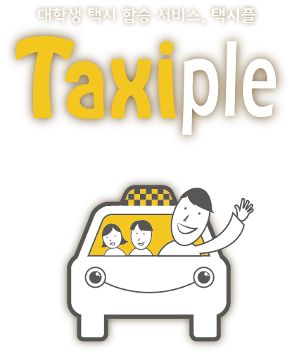

# Taxiple 택시 카풀서비스

## 2016년에 멋쟁이사자처럼 동기들과 만든 택시 공유서비스

아래는 당시 홍보했던 내용.

> 대학생 택시 합승 서비스, Taxiple (www.taxiple.com)
> 등교길 답답한 버스 대신 택시를 같이 타고 등교해보는 것은 어떨까? 라는 아이디어에서 출발한 대학생 택시 합승 서비스입니다. 자세한 > 설명은 위의 도메인으로 가주세요!
> 
> 멋사 3기 전준수, 문승현, 김우정 님이 같이 팀을 이뤄서 진행했던 프로젝트입니다. 
> 멋사 내에서 개최한 ‘아이디어톤’ 대회에서 100개 팀 중 10위 안에 들었습니다.
> 현재는 단국대 창업동아리에 들어갔으며 전준수님이 계속 맡아 프로젝트를 진행하고 있습니다.
